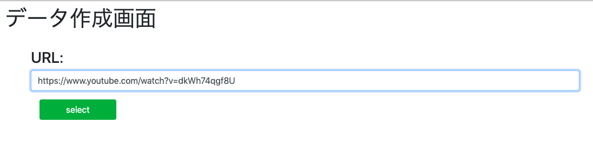
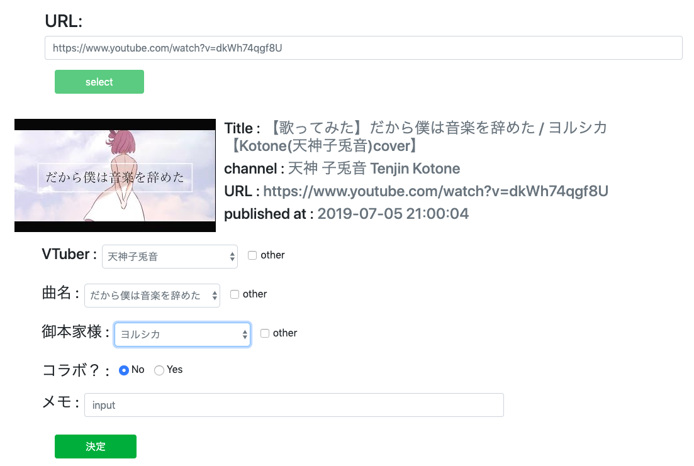

# VTuberの歌ってみた動画のデータセット
## これは何？
VTuberが投稿した歌ってみた動画の情報を人力で集めたデータセット  
「誰(VTuber)が誰の何の曲を(誰と)いつ歌ったか」を集めている

## データセット
[これ](/data/vtuber_music.csv)

## 仕様
csvファイルに以下のカラムで保存してある。
`,vtuber,music,original,collab,collabVTuber,id,channelId,publishedAt,memo`  
- `(index)`: 行番号
- `vtuber`: 実際に歌ったVTuber
- `music`: 歌った曲名
- `original`: 曲を歌った本家の方
    - ~Pだったり、アーティスト名だったり、アニメのタイトルだったりして、誰の曲かが判別できればオッケー程度に考えてる
    - ToDo: Best Practice
- `collab`: 誰かとコラボしているか
- `collabVTuber`: コラボしている場合、そのVTuber。
- `id`: 動画の固有のid
    - URLは`https://www.youtube.com/watch?v={id}`となる
- `channelId`: 投稿者固有のid
    - URLは`https://www.youtube.com/channel/{channelId}`となる
- `publishedAt`: 動画が投稿された日時
    - `%Y-%m-%d %H:%M:%S`
- `memo`: その他で注意しておくべき事
    - 3人で歌ってみた動画などは、3人目をここに記入

## 開発者向け
### 環境構築
動作確認済み  
`Python >= 3.5`  

依存ライブラリのインストール  
`pip install -r requirements.txt`

YouTube Data APIのキーの設定  
YouTube Data API v3が使えるAPIキーを用意し、`keys.py`を`app.py`と同じディレクトリ下に作成する。  
```keys.py
API_KEY = "your API key"
```
と`keys.py`に記入する。

### 使い方
GUIで入力するため、flaskアプリを用いている。  
そのためのflaskアプリの起動  
`python app.py`  

起動すると以下の画面が表示される  

この入力フォームに動画のURLを入力  
（`https://www.youtube.com/watch?v={id}`の形式じゃないと送信することができない仕様になっています）  

送信するとYouTubeAPIを使って必要な情報が出てきます

選択フォームは動画のタグから抽出しています。そこから正しいデータを選択します。  
（存在しない場合は`other`と書かれたチェックボックスをチェックすれば、自由に記入出来るフォームが現れるので、そちらに入力します）  
コラボはデフォルトで`No`になっており、`Yes`にすれば入力フォームが現れます  
すべて入力したら、`決定`を押します。そうすると、csvに保存されます。

### その他QA
- データを間違えた
    - プログラムを終了し、csvを直接書き換えましょう
    
- URLが受け付けられない
    - 既に存在しているidだと、データの追加はできないです。grepして上記と同様に書き換えます。
